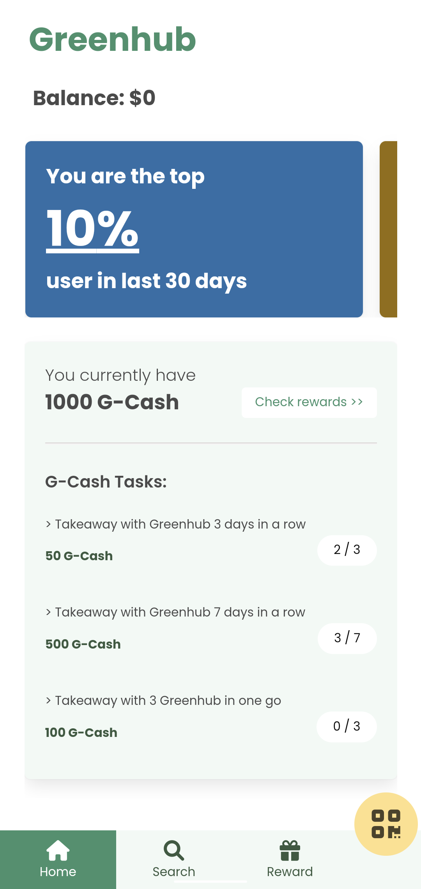
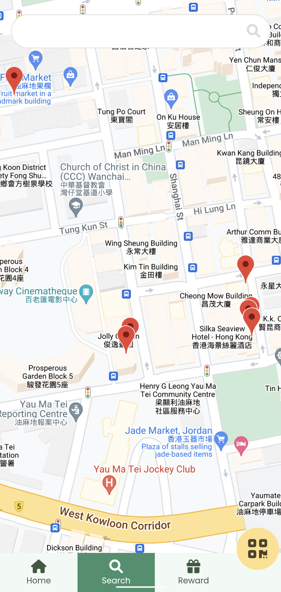
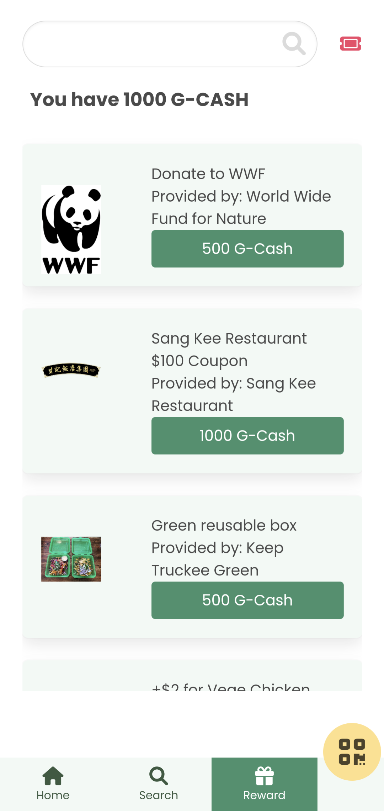
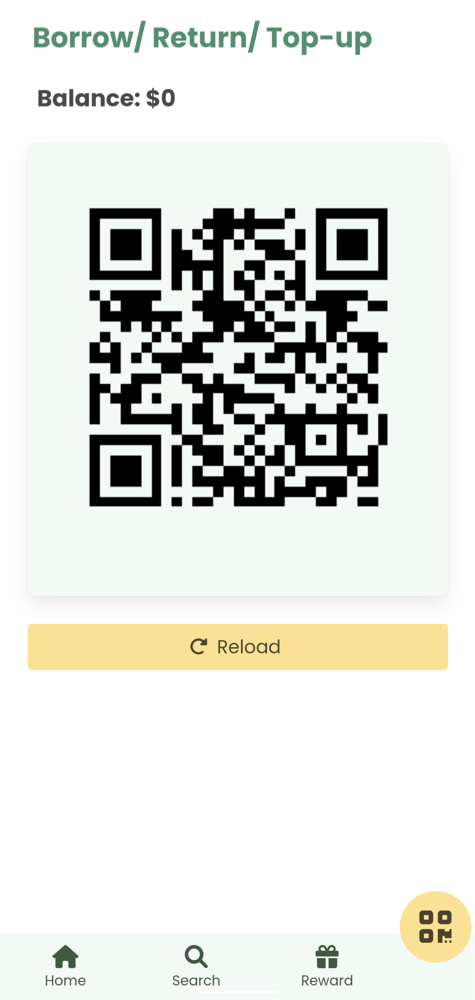
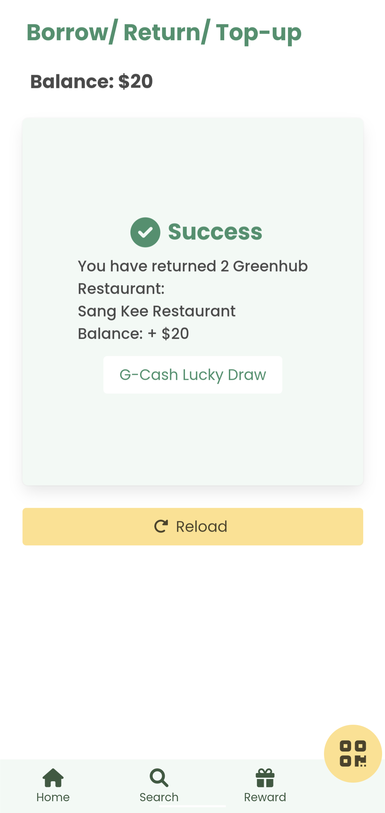

# greenhub-mobile-client

A web mobile application for Greenhub users. Aim to make the experience of using Greenhub service fluent and user-friendly.

## Usage

1. Access [https://greenhub.slmaaa.work](https://greenhub.slmaaa.work)
2. (Optional) Add application to home page

## Main screens

1.  Home
    Contains dashboards which show interesting and motivating data to the users. List of tasks will be generated for the users in order to motivate them using Greehub. 
    

2.  Search
    Render Greenhub restaurants as maskers on a map (Provided using Google Map API). User can check for more details by pressing on one of the markers. 
    TODO: Search for Greenhub Restaurants with filters
     
    
    

3.  Reward
    Show rewards that could be redeemed using G-CASH (credits rewarded by using Greenhub).
     
    TODO: Reward redeeming, use redeemed coupon, search function with filter 
    

4.  Borrow/return/top-up
    Three operations: "Borrow", "Return" and "Top-up" will be done using the same QR code.
    The app will request a UUID from the server. After the operation is processed by the Greenhub Restaurant (scanning QR code) and verified by the server. The user will receive a response with details.
     
    
    

## Framworks and Libraries used

Framework: Preact 
UI: Bulma
